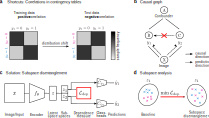

# Medical Shortcut Mitigation

Code for the paper:

**Mitigating Shortcut Learning via Feature Disentanglement in Medical Imaging: A Benchmark Study**

## Overview



We study **shortcut learning** in a multi-task setting with two binary tasks: a primary task $y_1$ and a spuriously correlated auxiliary task $y_2$, both predicted from the same image $x$. Shortcut learning occurs when models exploit correlations between $y_1$ and $y_2$ instead of learning task-relevant features.  

To address this, we employ **latent space splitting for feature disentanglement**, mapping images to task-specific subspaces.  

This repository provides a **benchmarking framework** for shortcut mitigation, combining multiple datasets with controlled confounding, a unified evaluation pipeline, and disentanglement-based methods for **systematic comparison under distribution shifts**.

## Environment Setup

Create a reproducible Python environment using UV (Unicorn/UV):

1. Sync environment:

```bash
uv sync
```

- Installs all dependencies from `uv.lock`  
- Packages the project from `src/`  

2. Activate environment:

```bash
source .venv/bin/activate
```

Once activated, Python will use this environment for all scripts.

## Pretrained Models

Pretrained weights and result files are provided via [Zenodo](https://doi.org/10.5281/zenodo.18630074). You can download models for individual datasets:

```bash
python scripts/download_pretrained_models.py --folders morpho_mnist
```
Extracted files recreate the same experiment directory structure used by the training scripts. The downloaded models can be used directly with the evaluation and visualization scripts to reproduce the figures and analyses reported in the paper.

## Quickstart (Toy Example)

Run a single fold of the baseline method on Morpho-MNIST:

1. Download dataset (global subset only):

```bash
python src/shortcut/data/download/morpho_mnist.py -d /path/to/dataset/ -v True
```

Set `data.dataset_path` in your config to `/path/to/dataset/global/`.

2. Run one fold:

```bash
python train.py --cfg configs/default.yaml
python test.py --cfg configs/default.yaml
```

3. Optional: override config options

```bash
python train.py --cfg configs/default.yaml --training/fold 3
python test.py --cfg configs/default.yaml --training/fold 3
```

Works for any key, e.g., `--training/num_folds 10`, `--model/method Baseline`.

## Scaling Up

- k-fold Cross-Validation:

```bash
sh scripts/local/train_kfold.sh <config.yaml> <num_folds>
sh scripts/local/test_kfold.sh <config.yaml> <num_folds>
```

- Prevalence Ablation:

```bash
sh scripts/local/prevalence_ablation.sh <num_folds> <experiment_root> <base_config_dir> <method> '[0,1]' 70 80
```

> SLURM versions exist in `scripts/slurm/` for cluster execution.

## Available Methods, Encoders, and Metrics

- Methods: `Baseline`, `Rebalancing`, `MINE`, `dCor`, `adv_cl`, `MMD`  
- Encoders: `simple_encoder`, `resnet` (backbone: 18, 24, 50), `efficientnet_b1`  
- Metrics: `Accuracy`, `BalancedAcc`, `Kappa`, `AUROC`, `AUPRC`, `MeanAbsoluteError`, `MeanSquaredError`  

## Optional: Evaluation & Visualization
These scripts work with both newly trained models and the pretrained models provided via [Zenodo](https://doi.org/10.5281/zenodo.18630074).

- `src/shortcut/evaluation/` -- disentanglement performance, compute-time measurement  
- `src/shortcut/visualization/` -- contains the code to recreate all figures from the paper: label distributions, scatterplots, prevalence ablation, convergence plots

## Citation
If you use this repository, code, or pretrained model weights, please cite either the Zenodo release for the software:
```bibtex
@software{mueller2026code,
  author       = {Sarah Mueller and Philipp Berens},
  title        = {Pretrained Models and Benchmark Results for Medical Shortcut Mitigation},
  year         = {2026},
  publisher    = {Zenodo},
  doi          = {10.5281/zenodo.18630074},
  url          = {https://doi.org/10.5281/zenodo.18630074}
}
```
or the associated arXiv paper for the scientific results:
```bibtex
@misc{mueller2026mitigating,
  author       = {Sarah Mueller and Philipp Berens},
  title        = {Mitigating Shortcut Learning via Feature Disentanglement in Medical Imaging: A Benchmark Study},
  year         = {2026},
  eprint       = {2602.18502},
  archivePrefix= {arXiv},
  primaryClass = {cs.CV},
  url          = {https://arxiv.org/abs/2602.18502}
}
```
